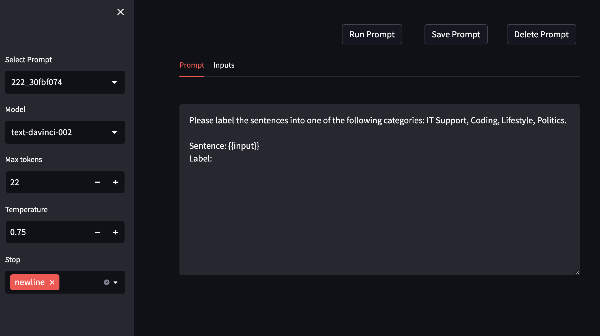
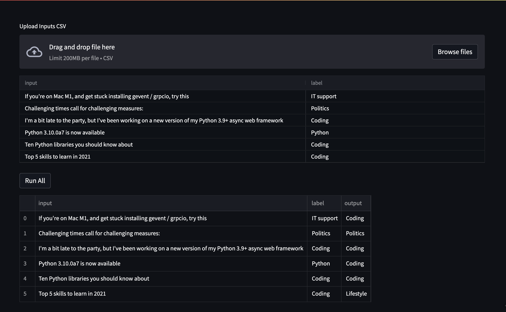

# Streamlit Playground (e.g. OpenAI Playground)

(Attempt) to replicate OpenAI playground in Streamlit, but with additional features like running batches of inputs.

### Playground



### Batch Inputs




## Setup

Requires Python 3.6+. Tested on Mac M1 Python 3.9.

1. Create an account with OpenAI and add your API key to `.env.secrets`

2. Install python requirements.

```bash
# Ensure you're using python 3.6+
python3 --version

# Uses your default python environment
pip3 install -r requirements.txt

# Alternatively, create a virtual environment (recommended)
pip3 install virtualenv
virtualenv .venv --python python3
source .venv/bin/activate
pip3 install -r requirements.txt
```

NOTE: If you're on Mac M1, and get stuck installing gevent / grpcio, try this:

```bash
pip3 install --no-cache-dir --upgrade --force-reinstall -Iv grpcio gevent

pip3 install -r requirements.txt
```

3. Run streamlit

```bash
# Run the streamlit app
streamlit run playground_streamlit.py

# Should open a new tab in your browser at
http://localhost:8501/

# If running on remote box (EC2, etc). Expose the port, then:
streamlit run --server.headless true playground_streamlit.py --server.port 8502
```

## Adding passwords

If you're hosting, do this to get password protection.

```bash

```

## Backlog

- S3 backend for saving prompts, inputs
- Add more models/providers
- Streaming completions

Feel free to add features and submit PRs!
